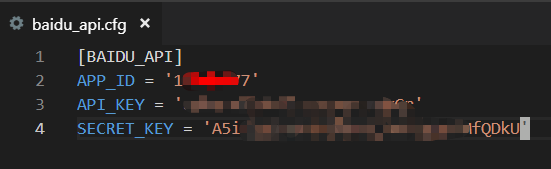
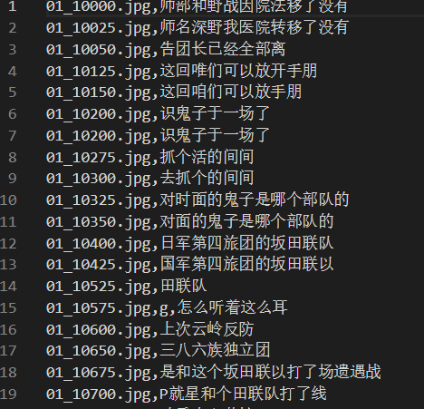

# 《亮剑》表情包索引工具

《亮剑》是2005年9月首播并在2006年热映于中国大陆的战争题材电视剧。
《亮剑》不仅是经典的爱国主义教育影片，而且是网络表情包素材的重要采集地。

长期以来，网友们对《亮剑》表情包的整理基本上都是纯手工的，这导致了表情包无法进行有效地管理和检索。
本项目尝试用比较自动化地方法来检索《亮剑》的画帧，覆盖了几乎所有的台词，方便各位朋友快速地找出对应的表情包。

祝大家在斗图大战中发挥亮剑精神！
我的邮箱是: lynnshawnvon@gmail.com

# 制作步骤

## 准备亮剑视频

在本项目的根目录下建立`/data`文件夹，在`/data`文件夹中建立`/video`文件夹，并在其中存放《亮剑》的原视频。

## 截取视频画面

切换到`util/`文件夹，运行`python save_frame.py`即可保持所有视频的截屏。
截屏过程分成两步骤：
第一、每隔25帧截取画面一次（约1秒）；
第二、预判断该画面是否存在字幕；

截屏的结果将会保存在`data/image`文件夹下，其中每集有单独的子文件夹。

预判画面是否存在字幕的代码见`util/detect_subtitle.py`，准确率大约为70%左右。

## 字幕文本识别

切换到`util/`文件夹，运行`python parse_ocr.py`即可调用百度OCR接口提取字幕内容。

百度OCR接口每天可以免费使用50000次。
此处不公布我的百度key，大家需要先去注册一个百度开发者账号。

注册百度API账号之后，在`util/`文件夹下创建一个`baidu_api.cfg`文件，把自己的密码写在这个文件中。

百度OCR的结果会保持在`data/content`文件夹下的某个`csv`文件中。
每集有单独的`csv`文件，而每个画面的字幕提取占据了文件的一行。

## 字幕内容清洗

这个部分还在艰苦地进行，主要有以下的两个原因。

第一、百度OCR并没有很准确地把字幕提取出来，还有不少的错别字或者乱码。

第二、我截取视频的时候出现了不少重复图片，这里需要作出合并。